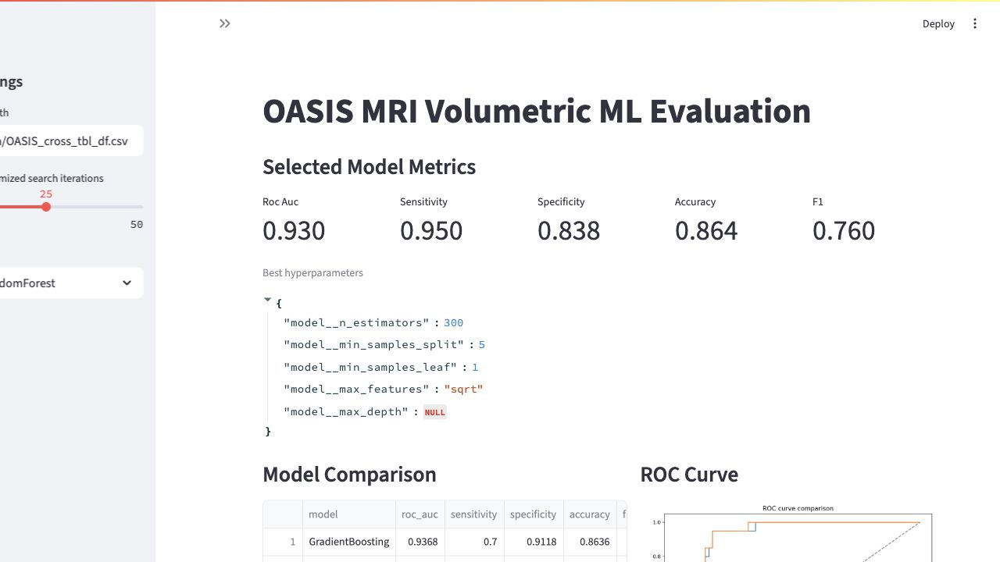
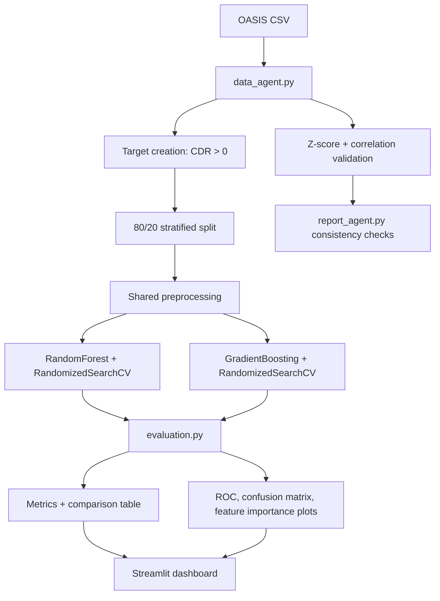

# OASIS MRI Volumetric ML Evaluation Platform

An end-to-end, portfolio-ready healthcare ML project for dementia-risk classification from OASIS cross-sectional MRI tabular data. The pipeline compares tree-based classifiers, performs reproducible hyperparameter tuning, validates clinical-style z-score behavior, and presents results in a Streamlit dashboard.

The project is built around the OASIS cross-sectional MRI dataset exposed by NeuroDataSets. The table contains 436 observations with demographic, cognitive, and volumetric variables such as `Age`, `MMSE`, `CDR`, `eTIV`, `nWBV`, and `ASF`.

## Highlights

- Modular agent-style architecture: `data_agent`, `model_agent`, `evaluation`, `report_agent`, and `app`
- Dementia target creation from `CDR > 0`
- Leakage-aware feature handling: `CDR` is excluded after target creation
- Shared preprocessing pipeline for both models
- 80/20 stratified train-test split
- 5-fold stratified cross-validation
- `RandomizedSearchCV` hyperparameter tuning for both models
- RandomForest vs GradientBoosting model comparison
- ROC-AUC, sensitivity, specificity, accuracy, F1, and confusion matrix reporting
- Clinical-style z-score validation and report consistency checks
- Streamlit dashboard for model selection and visual comparison

## Dashboard



The dashboard lets users select either `RandomForest` or `GradientBoosting`, inspect tuned parameters, compare metrics, and review ROC and confusion-matrix plots.

## Architecture



## Current Results

Latest local run on an 80/20 stratified split:

| Model | ROC-AUC | Sensitivity | Specificity | Accuracy | F1 |
| --- | ---: | ---: | ---: | ---: | ---: |
| GradientBoosting | 0.937 | 0.700 | 0.912 | 0.864 | 0.700 |
| RandomForest | 0.930 | 0.950 | 0.838 | 0.864 | 0.760 |

By test ROC-AUC, **GradientBoosting** is the best-performing model. From a clinical screening perspective, **RandomForest may be preferable** because it has much higher sensitivity, meaning it misses fewer positive dementia cases in this run.

Best tuned parameters:

| Model | Key Parameters |
| --- | --- |
| RandomForest | `n_estimators=300`, `min_samples_split=5`, `min_samples_leaf=1`, `max_features=sqrt`, `max_depth=None` |
| GradientBoosting | `n_estimators=100`, `learning_rate=0.0733`, `max_depth=4`, `min_samples_split=10`, `min_samples_leaf=1`, `subsample=0.7` |

Clinical validation from the latest run:

- z-score means are approximately 0
- z-score standard deviations are approximately 1
- Age vs `nWBV` correlation: `-0.874`

## Dataset

The project expects the real OASIS CSV at:

```text
data/OASIS_cross_tbl_df.csv
```

Expected columns:

```text
ID, M/F, Hand, Age, Educ, SES, MMSE, CDR, eTIV, nWBV, ASF, Delay
```

To export the NeuroDataSets version from R:

```r
install.packages("NeuroDataSets")
library(NeuroDataSets)

data(OASIS_cross_tbl_df)

write.csv(
  OASIS_cross_tbl_df,
  "data/OASIS_cross_tbl_df.csv",
  row.names = FALSE
)
```

If the CSV is absent, the project uses a deterministic OASIS-shaped demo dataset so the app and code paths remain runnable. Use the real CSV for meaningful analysis.

## Data License and Acknowledgement

This repository does not include the OASIS CSV. Users should download or export the dataset themselves and place it under `data/`.

The Kaggle mirror of `oasis_cross-sectional.csv` is listed as **CC0: Public Domain**. The original OASIS project asks that publications benefiting from OASIS data acknowledge the following grants:

```text
P50 AG05681, P01 AG03991, R01 AG021910, P20 MH071616, U24 RR0213
```

Dataset sources:

- [NeuroDataSets OASIS_cross_tbl_df reference](https://lightbluetitan.github.io/neurodatasets/reference/OASIS_cross_tbl_df.html)
- [Kaggle MRI and Alzheimers dataset](https://www.kaggle.com/datasets/jboysen/mri-and-alzheimers)
- [OASIS project](https://sites.wustl.edu/oasisbrains/)

## Quick Start

Set up the project:

```bash
python3 -m venv .venv
source .venv/bin/activate
pip install -r requirements.txt
```

Run the backend evaluation pipeline:

```bash
python3 main.py
```

Launch the dashboard:

```bash
streamlit run app.py
```

## Generated Artifacts

The pipeline writes:

```text
outputs/results_summary.json
outputs/plots/roc_curves.png
outputs/plots/randomforest_confusion_matrix.png
outputs/plots/gradientboosting_confusion_matrix.png
outputs/plots/metric_comparison.png
outputs/plots/randomforest_feature_importance.png
outputs/plots/correlation_heatmap.png
```

## Project Structure

```text
.
├── app.py                  # Streamlit dashboard
├── data_agent.py           # Loading, target creation, preprocessing, split, z-scores
├── model_agent.py          # RandomForest and GradientBoosting tuning
├── evaluation.py           # Metrics, CV, comparison tables, plots
├── report_agent.py         # Clinical-style report consistency checks
├── main.py                 # CLI training/evaluation pipeline
├── data/                   # Local CSV data
├── docs/assets/            # README dashboard screenshots
├── outputs/                # Generated metrics and plots
├── requirements.txt
└── README.md
```

## Limitations

- This is a tabular MRI-volumetric project, not a raw MRI image segmentation pipeline.
- The dataset is small, so results should be presented as a reproducible ML exercise rather than a deployable diagnostic system.
- `CDR` is used to create the target and is intentionally removed from model features to avoid leakage.
- A real clinical deployment would require external validation, calibration, threshold governance, bias analysis, privacy review, and clinician oversight.
